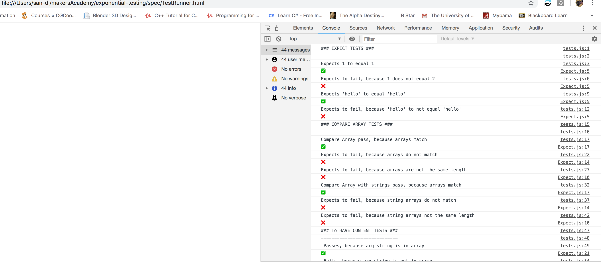

# EXPONENTIAL NOTES
________
## Overview:
Exponential Notes is a testing frame work in JS created by
* https://github.com/toddpla,
* https://github.com/RyanWolfen7

      We created Exponential Notes, after learning JS just two days
      prior, to gain a better understanding of both how JS and
      Testing FrameWorks work. Another goal we had was to have a
      functioning frame work to utilize for a 6 person team challenge
      to make a single page web app
      https://github.com/RyanWolfen7/exponential-notes
      without using any pre-existing FrameWorks.

## How to use this FrameWork
* Simply clone this file into your JS project
`````
git clone https://github.com/RyanWolfen7/exponential-notes.git
`````
* Update the testing suite into the TestRunner.html file
`````
#### In TestRunner.html ####
<!-- testing suite -->
<script src="../[YOUR_PROJECT_PATH]/lib/Expect.js" type="text/javascript"></script>
`````
* Add your Model paths to the models in the TestRunner.html file
``````
#### In TestRunner.html ####
<!-- models -->
<script src="../lib/EXAMPLE.js" type="text/javascript"></script>
<script src="../lib/EXAMPLE_TWO.js" type="text/javascript"></script>
<script src="../lib/views/EXAMPLE.js" type="text/javascript"></script>
``````
* Create a test runner in the spec file
`````
touch spec/fileYouAreTesting.js
`````
* Add your files to the TestRunner.html TestRunner
``````
#### In TestRunner.html ####
<!-- test runner -->
<script src="tests.js" type="text/javascript"></script>
<script src="fileYouAreTesting.js" type="text/javascript"></script>
``````
* Then copy the TestRunner.html path into you preferred browser
* open up the dev tools and look at the console.
##### Example:
  
* Please Note that You have to write your own console.log statements
##### Example:
`````
console.log("### EXPECT TESTS ###")
console.log("--------------------")
console.log("Expects 1 to equal 1")
expect(1).toEqual(1)
`````

## Contributing

Feel Free to add to, adjust, or completely reconfigure this any way you see fir. This is mostly just a showcase for our skills with Test Driven Development, but if you feel compelled to make our frame work more robust for this repo and submit a pull request.
